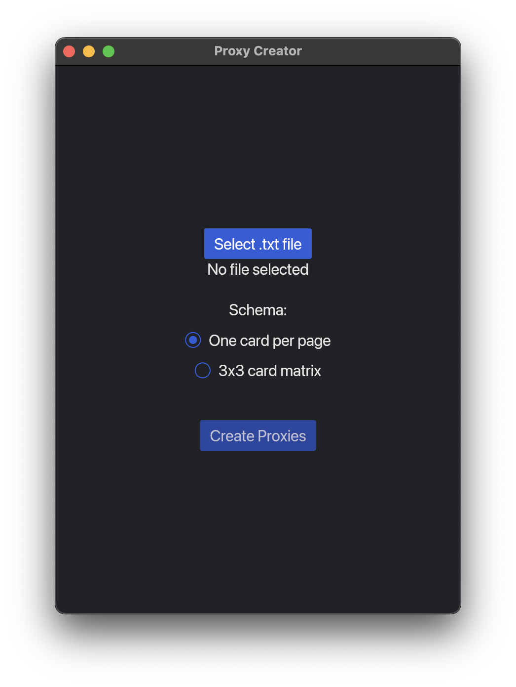

# MTG Proxy Creator (PDF)


Magic: The Gathering (MTG) Proxy Creator written in Rust. The file-picker let's you choose a decklist file, fetches card images using the [Scryfall API](https://scryfall.com/docs/api) and compiles them into a PDF file (either as one card per page or a 3x3 grid).



## Features

- **Decklist Parsing**: Parses a given decklist text file to extract card names and set names.
- **Image Fetching**: Utilizes the Scryfall API to fetch card images in PNG format.
- **PDF Generation**: Compiles the fetched card images into a PDF document using the `printpdf` crate.
- **Image Transformation**: Includes functionality to handle image alpha channels for proper rendering in the PDF.

## Download

Compiled binaries are automatically generated for each commit to the `main` branch.

➡️ [Latest build artifacts](https://github.com/martinbremm/mtg-proxy-creator-rust/actions?query=branch%3Amain+is%3Asuccess)

**Available Artifacts:**
- `mtg-proxy-creator-x86_64-unknown-linux-gnu.zip`
- `mtg-proxy-creator-x86_64-pc-windows-msvc.zip`
- `mtg-proxy-creator-aarch64-apple-darwin.zip`

To download:
1. Click the latest workflow run.
2. Scroll down to the **Artifacts** section.
3. Download your desired platform build.

## Setup

1. Clone this repository:
   ```bash
   git clone https://github.com/martinbremm/mtg-proxy-creator-rust
   cd mtg-deck-image-pdf
   ```

2. Install Rust dependencies:
   ```bash
   cargo build
   ```

## Usage

1. Prepare your decklist in a text file (e.g., `my_decklist.txt`), following a specific format (each line containing card name and set name).
2. Run the program:
   ```bash
   cargo run
   ```

3. The program will prompt you to select the decklist text file.
4. It will fetch card images, compile them into a PDF, and save it in the project directory.

## Notes

- Ensure a stable internet connection for image fetching from Scryfall API.
- Customize the decklist file format or API endpoints if necessary.
- Check API usage limits to avoid hitting rate limits or exceeding quotas.

## Credits

- This project uses the [Scryfall API](https://scryfall.com/docs/api) for fetching card images.
- Portions of the code are adapted from various Rust libraries and contributors.

## Contributing

- Martin Bremm ([Your GitHub](https://github.com/martinbremm))

If you want others to contribute to your project, provide guidelines on how they can do so. Include information on submitting bug reports, feature requests, or pull requests.

```markdown
## Contributing Guidelines

1. Fork the repository
2. Create a new branch: `git checkout -b feature/your-feature`
3. Make your changes and commit them: `git commit -m 'Add new feature'`
4. Push to the branch: `git push origin feature/your-feature`
5. Submit a pull request
```

## License

This project is licensed under the Apache License 2.0 - see the [LICENSE](LICENSE) file for details.

```
Apache License
Version 2.0, January 2004
http://www.apache.org/licenses/
```
